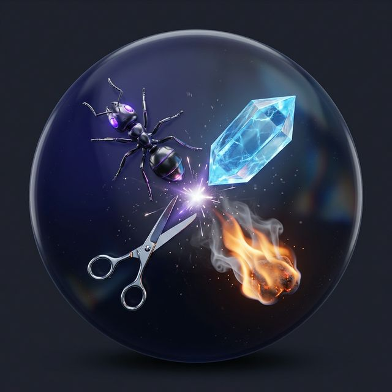
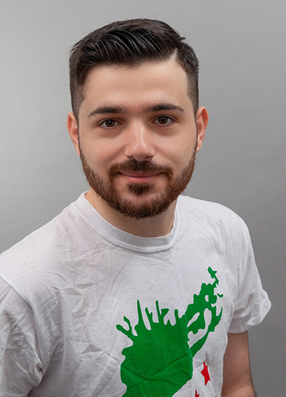

<p align="center">
  
</p>

<h1 align="center">⚙️ ASMR BATTLE FACTORY ⚙️</h1>

<p align="center">
  <strong>The Ultimate AI Production Studio for Cinematic ASMR Battles</strong>
  <br />
  استوديو الإنتاج المتكامل لمعارك الـ ASMR السينمائية المدعومة بالذكاء الاصطناعي
</p>

<p align="center">
  
  
  
  
</p>

---

## 🌟 Vision | الرؤية

<table>
  <tr>
    <td width="50%">
      <h3>English</h3>
      <b>ASMR Battle Factory</b> is a professional workstation designed for short-form content creators (TikTok, YouTube Shorts, Reels). We shift the paradigm from "one-off AI prompts" to a robust <b>Project-Based Production Workflow</b>. 
      <br /><br />
      Our "Director's Studio" aesthetic provides complete mastery over the creative process, from fighter selection to neural narrative orchestration.
    </td>
    <td width="50%">
      <h3>العربية</h3>
      <b>ASMR Battle Factory</b> هو محطة عمل احترافية مصممة خصيصاً لصناع المحتوى (TikTok, YouTube Shorts). نحن ننتقل من فكرة "الأوامر العشوائية" إلى <b>نظام إنتاج متكامل قائم على المشاريع</b>.
      <br /><br />
      تمنحك جمالية "استوديو المخرج" سيادة كاملة على العملية الإبداعية، بدءاً من اختيار المقاتلين وصولاً إلى تنسيق السرد القصصي العصبي.
    </td>
  </tr>
</table>

---

## 🔥 Key Systems | الأنظمة الأساسية

### 🎨 Battle Studio Configurator
*   **Massive Library**: 50+ hand-picked contestants across 9 tactical categories.
*   **Logic Engine**: Sophisticated matchmaking that understands natural rivals and dramatic contrasts.
*   **Winning Modes**: Full control over outcomes—AI-Decided, Random Luck, or Manual Override.
*   **مكتبة ضخمة**: أكثر من 50 متسابقاً مختاراً بعناية ضمن 9 فئات تكتيكية.
*   **محرك المنطق**: نظام متطور يفهم الخصومات الطبيعية والتناقضات الدرامية.

### 💎 The Idea Vault
*   **Neural Batching**: Generate 5 epic scenarios in seconds at minimal cost.
*   **Creative Testing**: Swipe through scenarios, choose your masterpiece, and save it for future production.
*   **التوليد العصبي**: قم بتوليد 5 سيناريوهات ملحمية في ثوانٍ وبتكلفة زهيدة جداً.
*   **الاختبار الإبداعي**: تصفح السيناريوهات، اختر تحفتك الفنية، واحفظها للإنتاج المستقبلي.

### 🧪 API Maestro & Marketplace
*   **Neural Routing**: Orchestrate prompts across Gemini, Llama (Groq), GPT, and DeepSeek.
*   **BYOK System**: Securely manage your own API keys with local encryption.
*   **تنسيق العقول**: قم بتوزيع المهام بين أقوى موديلات الذكاء الاصطناعي (Gemini, Llama, GPT).
*   **نظام التشفير**: إدارة آمنة لمفاتيحك البرمجية مع تشفير محلي كامل.

---

## 🛠️ Technical Foundation | الأساس التقني

<table>
  <tr>
    <td width="50%">
      <h3>Framework & State</h3>
      <ul>
        <li><b>Flutter 3.27+</b> - High-performance rendering.</li>
        <li><b>Riverpod</b> - Reactive & scalable state.</li>
        <li><b>Clean Architecture</b> - Modular & testable codebase.</li>
      </ul>
    </td>
    <td width="50%">
      <h3>Neural Layer</h3>
      <ul>
        <li><b>Google Gemini Pro</b> - Primary creative brain.</li>
        <li><b>Meta Llama 3 (Groq)</b> - Lightning-fast inference.</li>
        <li><b>Hive</b> - Ultra-fast local persistence.</li>
      </ul>
    </td>
  </tr>
</table>

---

## 👨‍💻 Developed By | المطور

<p align="center">
  
</p>

<h3 align="center">Obada Dallo | عبادة دللو</h3>
<p align="center">
  <strong>Software Engineer & AI Architect</strong>
  <br />
  <i>Crafting the future of creative automation with code.</i>
  <br />
  مطور برمجيات ومعماري أنظمة ذكاء اصطناعي - نصنع مستقبل الأتمتة الإبداعية بالكود.
</p>

<p align="center">
  <a href="https://github.com/obadadallo"></a>
  <a href="https://linkedin.com/in/obadadallo"></a>
  <a href="https://t.me/obada_dallo"></a>
</p>

---

## 🚀 Quick Start | التشغيل السريع

```bash
# 1. Clone & Setup
git clone https://github.com/obadadallo/asmr_battle_factory.git
flutter pub get

# 2. Forge the Code
flutter pub run build_runner build --delete-conflicting-outputs

# 3. Enter the Studio
flutter run
```

---

<p align="center">
  <i>Made with 💜 for the next generation of content creators.</i>
  <br />
  صنع بكل حب من أجل الجيل القادم من صناع المحتوى.
</p>
